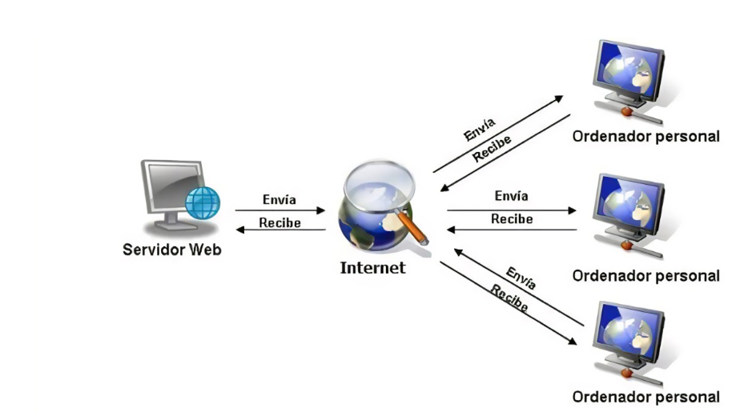

# Asix1_A2.-Puesta-en-pr-ctica-Documentaci-n-con-Markdown-

1. ¿Qué es una página web?
Un sitio web está formado por un conjunto de archivos que son accesibles a través de la red y se representan por medio de un lenguaje.

2. ¿Que es un servidor web?
Un servidor web es un programa informático que procesa una aplicación del lado del servidor

3. ¿Qué son los lenguajes de marcas? ¿Cuántos conoces?. 

Los lenguajes de marcas son sistemas de notación utilizados para definir la estructura y presentación de los contenidos de un documento.

|Lenguaje|Documentacion|
|----------|:-------------------|------------------------|
|HTML|[HTML](https://developer.mozilla.org/es/docs/Web/HTML)|
|XML|[XML](https://developer.mozilla.org/es/docs/Web/XML/XML_introduction)|
|Markdown|[Markdown](https://www.markdownguide.org/getting-started/)|

4. ¿Qué es ```HTML``` ? ¿Sabes cómo se estructura?

El Lenguaje de Marcado de Hipertexto (HTML) es el código que se utiliza para estructurar y desplegar una página web y sus contenidos.La estructura HTML de una página web se compone de las etiquetas **html**, que indica el comienzo de la página; **head**, que contiene información más descriptiva sobre el sitio; y **body**, que conforma todos los elementos visibles de la página.

```
<!DOCTYPE hmtl>
<html lang="en">
<head>
     <meta charset="UTF-8">
     <meta http-equiv="X-UA-Compatible" content="IE=edge">
     <meta name ="viezport" content="width=device-width, initial-scale=1.0">
     <title>Document</title>
</head>
<body>

</body>
</html>
```

5. ¿Que es ```CSS```?
    CSS es un lenguaje informático especializado en definir y cohesionar la presentación de un documento escrito en un lenguaje de marcadocomo HTML o XML.

6. ¿Sabes cómo funciona un navegador web? Describe brevemente el proceso que se sigue para visualizar una página web.:

    1.    Ingresar URL: El usuario escribe una URL (Uniform Resource Locator) en la barra de direcciones del navegador.

    2. Resolución DNS: El navegador envía una solicitud a un servidor DNS (Domain Name System) para obtener la dirección IP del servidor donde está alojada la página web.

    3. Solicitud HTTP: Con la dirección IP, el navegador envía una solicitud HTTP (HyperText Transfer Protocol) al servidor para obtener el contenido de la página.

    4. Respuesta del servidor: El servidor web responde con los archivos HTML, CSS, JavaScript y otros recursos necesarios para construir la página.

    5. Renderizado: El navegador procesa los archivos HTML y CSS para crear la estructura visual y el estilo de la página. También ejecuta cualquier código JavaScript.

    6. Visualización: Finalmente, el navegador muestra la página web completa y funcional en la pantalla del usuario.

    